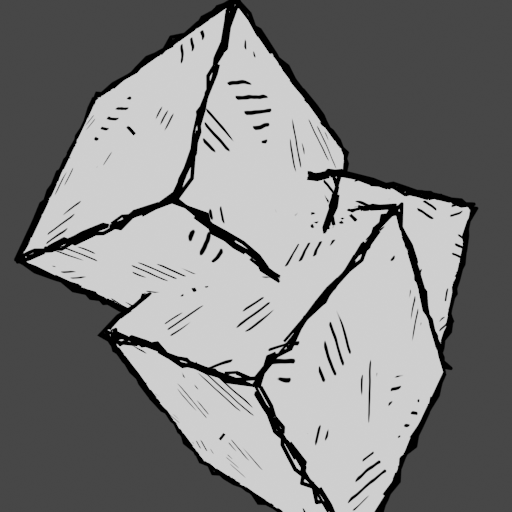
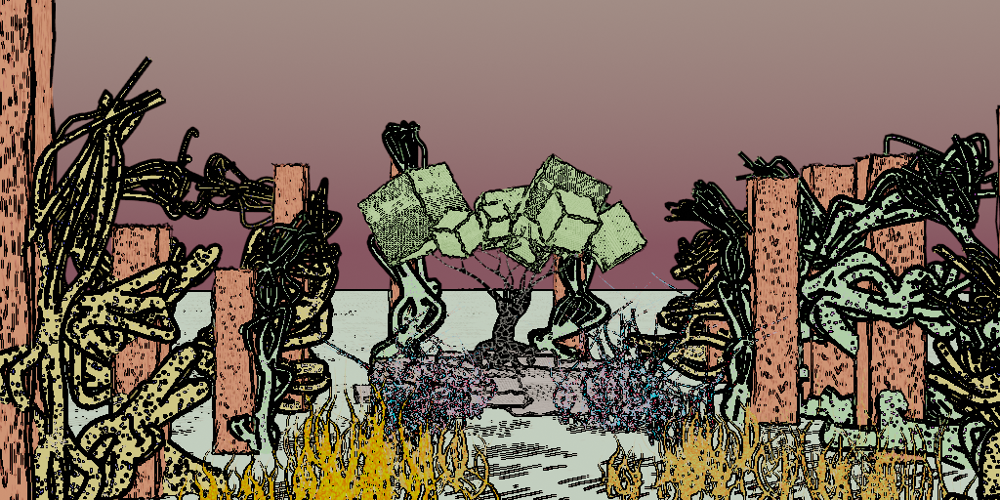
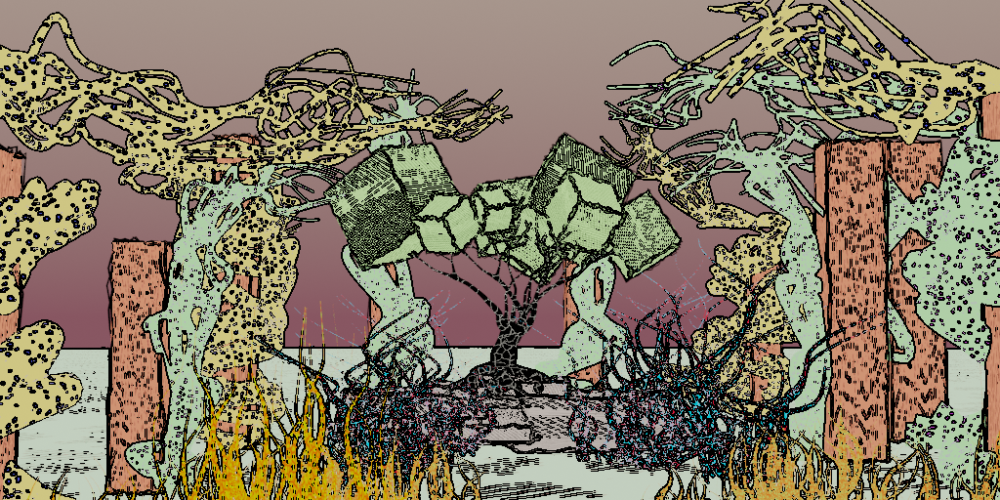
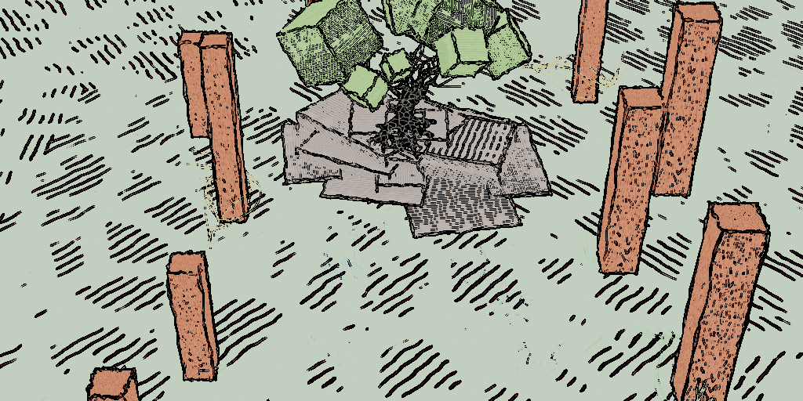

# Tech-Art And Animation

## Blender tech art draw-style and animation:
* Create procedural animation
* Introduce imperfections into rendered images

## Procedural animation:
* Blender Python API animation
* Script: `copy_animate_curve_extrude.py` - based on given curve, create curve copies with randomized transforms and applied animation of growth and curve extrusion (thickness).
* Script: `copy_animate_curve_bevel.py` - based on given curve, create curve copies with randomized transforms and applied animation of growth and curve bevel (thickness).
* Script: `grow_around_curve.py` - given input curve create multiple displaced curves around with grow and thickness animation.

## Edges rendering:

To render edges, combination of following methods was used:
* Procedural curves placed on polygons with black-non emissive material
* Blender Free-style rendering
* Blender Compositor filter node (sobel)

### Procedural splines via Blender Python API: 
* https://docs.blender.org/api/current/index.html
* Script: `procedural_spline_polygons.py` - create displaced splines around each polygon edge.
* Add black non-emissive shader to imitate lines.

<table>
<tr>
  <td></td>
  <td></td>
  <td></td>
  <td></td>
</tr>
</table>

### Blender Freestyle renderer: 
* https://docs.blender.org/manual/en/latest/render/freestyle/index.html
  * Advantage: wide range of possible edge lines and some which are not possible with simple edge detection.
  * Problem: very slow!

### Blender compositor
* filter, sobel node: https://docs.blender.org/manual/en/latest/compositing/types/filter/filter_node.html
  * Advantage: very fast
  * Problem: not all edges (contours) are captured!

## Faces rendering:
* All surfaces have emission shader applied to obtain "flat" looking appearance
* Hatching shaders: https://www.youtube.com/watch?v=2ZR5XIjBmho

