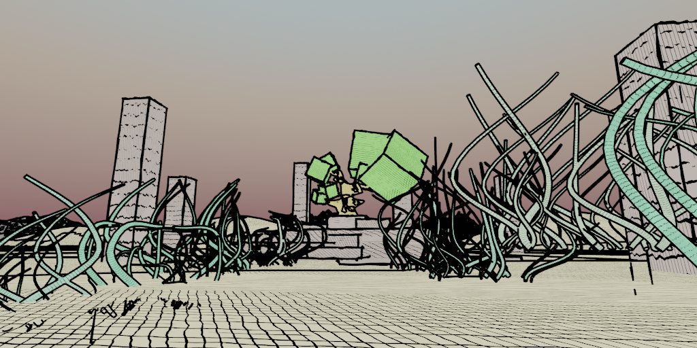
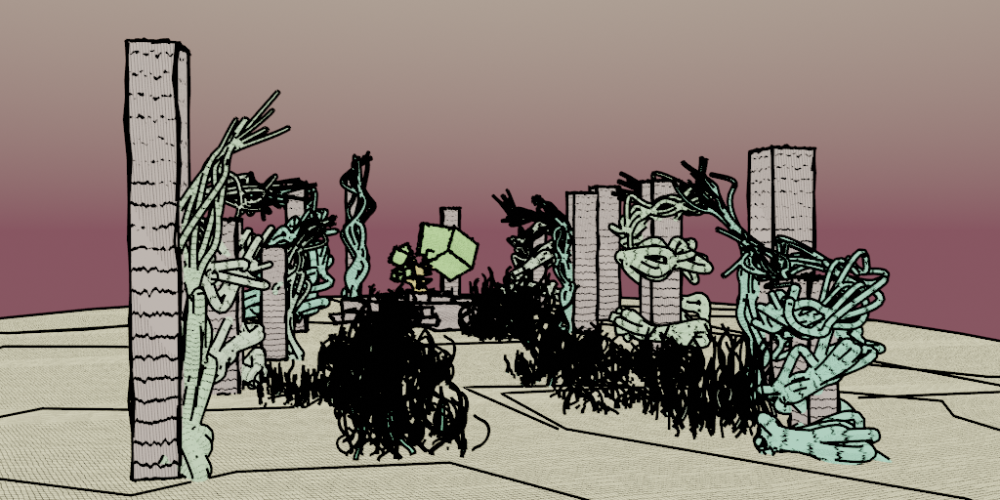
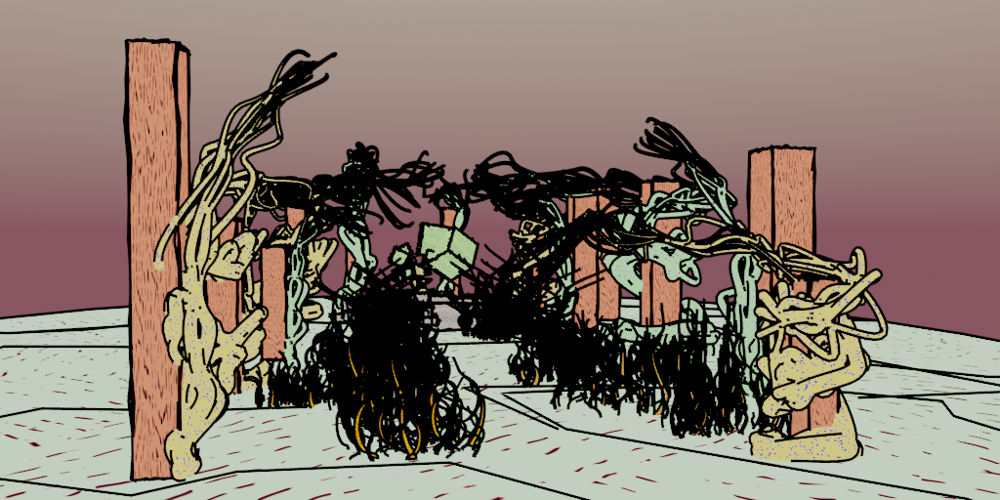

# Tech-Art: Draw style

Work in progress...

Blender tech art: draw-style animation. Goal:
* Create procedural animation
* Introduce imperfections into rendered images

Procedural animation:
* Blender Python API animation
* Script: `copy_animate_curve_extrude.py` - based on given curve, create curve copies with randomized transforms and applied animation of growth and curve extrusion (thickness).
* Script: `copy_animate_curve_bevel.py` - based on given curve, create curve copies with randomized transforms and applied animation of growth and curve bevel (thickness).

Edges rendering:
* Procedural splines via Blender Python API: https://docs.blender.org/api/current/index.html
  * Script: `procedural_spline_polygons.py` - create displaced splines around each polygon edge.
* Blender Freestyle renderer: https://docs.blender.org/manual/en/latest/render/freestyle/index.html
  * Advantage: wide range of possible edge lines and some which are not possible with simple edge detection.
  * Problem: very slow!
* Blender compositor - filter, sobol node: https://docs.blender.org/manual/en/latest/compositing/types/filter/filter_node.html
  * Advantage: very fast
  * Problem: not all edges are captured!

Faces rendering:
* Hatching shaders: https://www.youtube.com/watch?v=2ZR5XIjBmho

