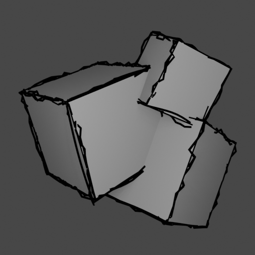
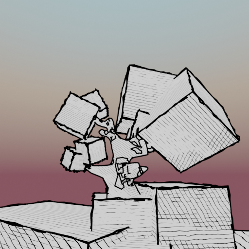
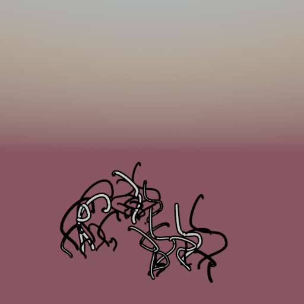
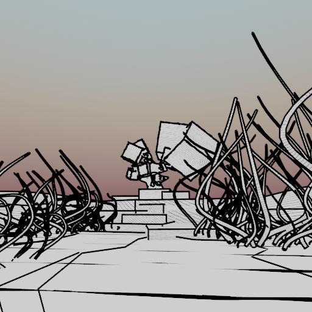
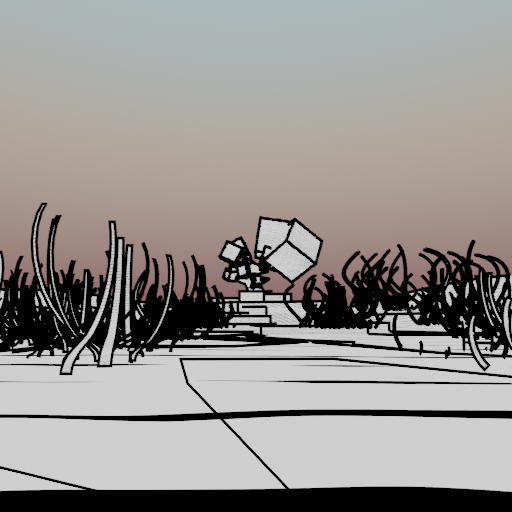

# Tech-Art: Draw style

Work in progress...

Blender tech art: draw-style images. Goal:
* Introduce imperfections into rendered images

Edges rendering:
* Procedural splines via Blender Python API: https://docs.blender.org/api/current/index.html
* Blender Freestyle renderer: https://docs.blender.org/manual/en/latest/render/freestyle/index.html

Faces rendering:
* Hatching shaders: https://www.youtube.com/watch?v=2ZR5XIjBmho

